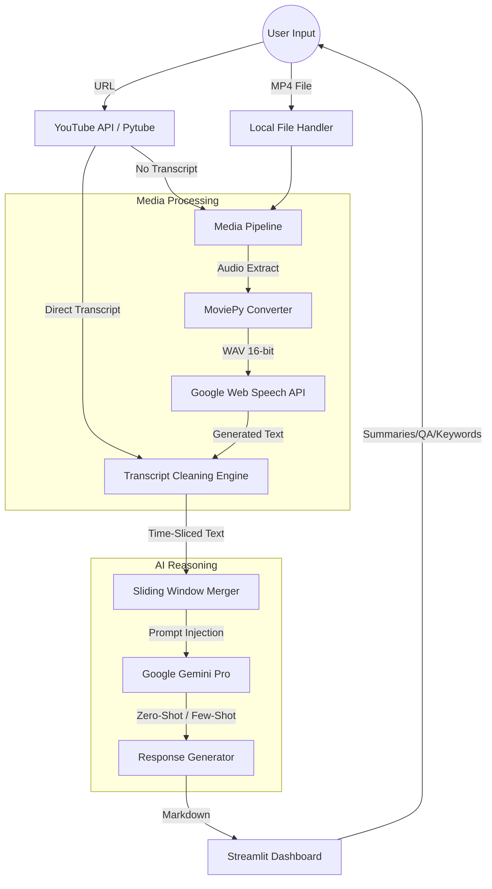

# YouTube Video Analysis Toolkit

This application is a high-performance intelligence suite designed to extract, process, and analyze video data using **Large Language Models (LLMs)** and **Automatic Speech Recognition (ASR)**. It transforms unstructured video content into structured, actionable insights.

---

## ## Architecture Diagram

The following Mermaid diagram illustrates the data flow and component interaction within the system.

---

## ## System Overview

### **1. Acquisition & Extraction Layer**
The system employs a dual-pathway strategy for data ingestion:
* **The Metadata Path:** Uses `pytube` and `youtube_transcript_api` to fetch pre-existing English captions. This is the "fast-track" and consumes minimal compute.
* **The Media Path:** If a video lacks captions or is a local file, the system triggers a heavy-processing pipeline. `MoviePy` transcodes the video into a specialized WAV format (Pulse-Code Modulation) to maximize accuracy for the speech recognition algorithms.

### **2. The "Sliding Window" Text Processor**
Raw transcripts are often disorganized and lack context. This architecture implements a **Time-Interval Merger**:
* It clusters transcript fragments into specific time windows (e.g., 4-minute blocks).
* It preserves `HH:MM:SS` timestamps, allowing the AI to "index" where specific topics occur.
* It sanitizes the text using Regex to remove non-narrative artifacts (closed-captioning cues, music tags, etc.).

### **3. The Intelligence Engine (Gemini Pro)**
The core "brain" of the application utilizes the `text-bison` model. The architecture treats the transcript as a **Vectorized Context Window**:
* **Summarization Logic:** Uses a constrained prompt to synthesize major points while adhering to strict word limits.
* **Keyword Extraction:** Performs an entity extraction pass to find high-value technical terms, which are then returned as a Python-executable list.
* **Context-Grounded Q&A:** Implements a strict "Context-Only" rule. The prompt prevents the LLM from using its internal training data to answer, forcing it to rely only on the provided transcript to eliminate hallucinations.

### **4. State-Persistent UI Layer**
Built on Streamlit, the presentation layer manages **Session State**. This ensures that once a transcript is processed or a summary is generated, the data is cached in the browser's memory. Users can switch between the "Summarizer," "Keyword Analyzer," and "Q&A" modules without re-triggering expensive API calls or re-processing the video.

---

## ## Technical Specifications

| Component | Technical Role |
| :--- | :--- |
| **Orchestration** | Streamlit |
| **LLM Inference** | Google Gemini (Generative AI SDK) |
| **Speech-to-Text** | Google Cloud Speech Recognition |
| **Media Transcoding** | MoviePy (FFmpeg Wrapper) |
| **Data Cleaning** | Regular Expressions & Datetime Delta logic |
| **Storage** | Volatile `/tmp/` caching for audio artifacts |
