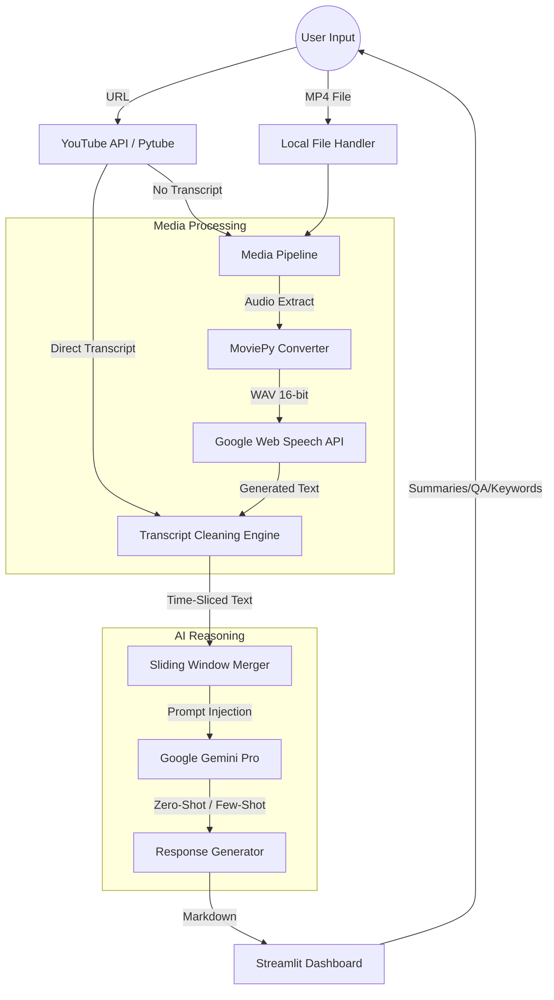

# 📺 YouTube Intelligence & Analysis Toolkit

An advanced **Multimodal Analysis** suite that transforms passive YouTube consumption into an interactive data-mining environment. Powered by **Gemini Pro** and **Google Web Speech ASR**, this tool provides high-fidelity summarization, semantic keyword mapping, and context-grounded Q&A.

---

## 🏗️ System Architecture

The application follows a **Modular Intelligence Pipeline**, separating raw data ingestion from cognitive reasoning layers to ensure low latency and high factual accuracy.



### 1. Multimodal Acquisition Layer
* **Transcript Engine:** Interfaces with `youtube-transcript-api` for lightning-fast retrieval of pre-existing English captions.
* **ASR Pipeline:** For videos without captions or local MP4s, the system utilizes `MoviePy` to extract audio, converting it to **16-bit Mono WAV** before passing it to the Google Web Speech API for synthetic transcription.

### 2. Cognitive Orchestration Layer
* **Sliding Window Merger:** Unlike raw text dumps, this layer uses `datetime` objects to cluster transcript fragments into 4-minute semantic blocks, preserving chronological context.
* **Context Grounding:** The Gemini inference engine is restricted via system prompts to use *only* the provided transcript, effectively eliminating AI hallucinations.

### 3. State Management & UI
* **Session Persistence:** Utilizes Streamlit's `session_state` to cache heavy AI computations, allowing users to toggle between summary, keywords, and Q&A views without re-triggering API costs.
* **Temporary Vault:** Uses a controlled `/tmp/` directory for audio transcoding, ensuring a clean footprint after processing.

---

## 🛠️ Tech Stack

| Component | Technology |
| :--- | :--- |
| **LLM Core** | Google Gemini Pro (`text-bison`) |
| **App Framework** | Streamlit |
| **Media Handling** | Pytube & MoviePy (FFmpeg) |
| **Speech-to-Text** | Google Web Speech ASR |
| **Data Logic** | Python `ast`, `re`, & `datetime` |

---

## 🧠 Intelligence Workflow

* **Extraction:** Raw transcript strings are cleaned via Regex to remove non-narrative artifacts.
* **Summarization:** A 300-word hierarchical summary is generated focusing on major discussed points while excluding speaker names.

* **Keyword Mapping:** The LLM performs an entity-extraction pass, returning a Python-literal list of 10 core topics.
* **Explainer Engine:** When a user selects a keyword, the system performs a targeted "Context-Search" to explain that specific term based on the video timeline.

---

## 📊 Technical Specifications

### Prompting Strategy
The system uses **Zero-Shot Prompting** for summarization and **Constrained Extraction** for keywords. By requesting a specific JSON/List format, the application uses `ast.literal_eval` to convert AI text directly into interactive UI elements.

### Persistence Logic
The app maintains a `merged_text` variable in the state:
```python
if 'merged_text' not in st.session_state:
    st.session_state.merged_text = generated_transcript
```
This ensures that the "Question Answering" module can access the entire video's history instantaneously for zero-latency user queries.
